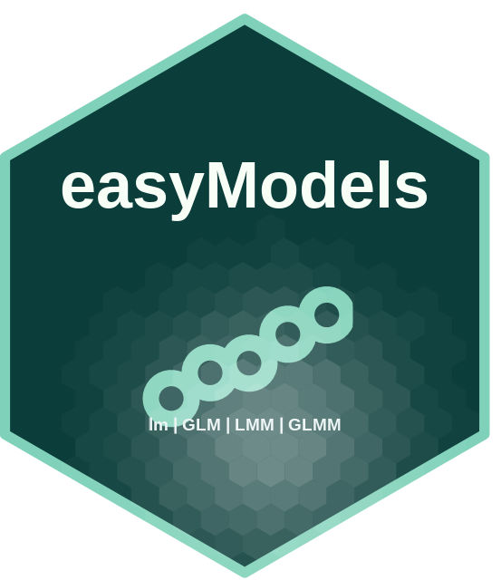

<div align="center">
  
</div>

# easyModels 

<!-- badges: start -->
[](https://github.com/PALP31/easyModels/actions/workflows/R-CMD-check.yaml)
[](https://lifecycle.r-lib.org/articles/stages.html)
[](https://github.com/PALP31/easyModels/releases/tag/v0.4.2)
[](https://www.r-project.org/)
[](https://opensource.org/licenses/MIT)
[](https://github.com/PALP31/easyModels/blob/main/vignettes/guia-easyModels.Rmd)
[](https://github.com/PALP31/easyModels/tree/main/tests)
[](https://github.com/PALP31/easyModels/commits/main)
[](https://github.com/PALP31/easyModels/issues)
[](https://github.com/PALP31/easyModels)
<!-- badges: end -->

> **Herramientas Automatizadas y Reproducibles para Modelos Lineales, Mixtos y Gráficos Científicos en R**

---

## 📖 Descripción General

**easyModels** es un paquete de R desarrollado por **Paúl Alexander López Peña** (Pontificia Universidad Católica de Chile) diseñado para automatizar y democratizar el análisis bioestadístico riguroso en ciencias biológicas, agronomía, ecología y medicina experimental.

Su filosofía central es **eliminar la fricción metodológica** al trabajar con diseños experimentales y modelos jerárquicos: convierte flujos complejos de fórmulas en `lme4`/`glmmTMB`, auditoría automática de supuestos, diagnósticos de `DHARMa`, comparaciones post-hoc y gráficos de publicación con letras de significancia (Tukey CLD) en una experiencia directa, robusta y 100% reproducible.

```
Datos Crudos ──► sugerir_modelo() ──► analizar_*() ──► verificar_supuestos() ──► graficar_predichos()
  (Ensayo)        (Asistente Box-Cox)  (LMM / GLMM)     (Auditoría Completa)    (Gráficos con Letras CLD)
```

---

## ⚡ Características Principales

* 🌾 **Diseños Experimentales Clásicos y Complejos:**
  - Wrappers directos para Bloques Completos al Azar (RCBD), Parcelas Divididas (Split-Plot), Cuadrados Latinos (LSD), Franjas Divididas (Strip-Plot / Criss-Cross) y Medidas Repetidas en el tiempo.
* 📈 **Jerarquía Unificada de Modelos (Clase S3 `easy_model`):**
  - Modelos Lineales (`analizar_lm`), Modelos Lineales Mixtos (`analizar_lmm`), GLM con **17 familias** (`analizar_glm`) y GLMM con **16 distribuciones** (`analizar_glmm` via `glmmTMB` y `lme4`).
* 🔍 **Auditoría Automatizada de Supuestos (`verificar_supuestos()`):**
  - Batería integrada: Normalidad (Shapiro-Wilk), Homocedasticidad (Breusch-Pagan / Levene), Multicolinealidad (VIF), Sobredispersión y detección de Influyentes (Distancia de Cook $> 4/n$).
* 🤖 **Asistente Inteligente de Familias y Transformaciones (`sugerir_modelo()`):**
  - Inspecciona ceros, proporciones $(0,1)$, conteos y sesgo positivo, calculando el parámetro óptimo Box-Cox ($\lambda$) y recomendando la familia de GLM adecuada.
* 📊 **Selección y Comparación de Modelos (`comparar_modelos()`):**
  - Ordenamiento por $AIC$, $\Delta AIC$, Pesos de Akaike ($w_i$), $BIC$, $LogLik$ y $R^2$ Marginal/Condicional.
* 🎨 **Gráficos Científicos Listos para Publicación (`graficar_predichos()`, `graficar_interaccion()`):**
  - Gráficos de **barras**, puntos o líneas con letras de significancia compacta (Tukey CLD), barras de error al 95% y paletas académicas (`teal`, `okabe_ito`, `viridis`, `cividis`, `set2`).
* 📄 **Tablas Formateadas para Tesis y Artículos:**
  - `exportar_tabla_anova()` y `exportar_tabla_posthoc()` en formato Markdown, LaTeX y HTML.

---

## 🚀 Instalación

Puedes instalar la versión de desarrollo de **easyModels** directamente desde GitHub usando `devtools`, `remotes` o `pak`:

```r
# Opción 1: Usando devtools
if (!requireNamespace("devtools", quietly = TRUE)) install.packages("devtools")
devtools::install_github("PALP31/easyModels")

# Opción 2: Usando pak (recomendado por velocidad)
# if (!requireNamespace("pak", quietly = TRUE)) install.packages("pak")
# pak::pkg_install("PALP31/easyModels")
```

Cargar la librería e inspeccionar el manual:

```r
library(easyModels)

# Acceder a la documentación global del paquete
?easyModels
```

---

## 🛠️ Flujo de Trabajo en 5 Minutos

A continuación se muestra un flujo completo de análisis bioestadístico para un ensayo agronómico en bloques:

```r
library(easyModels)
library(ggplot2)

# 1. Datos simulados: Rendimiento (ton/ha) bajo 3 tratamientos en 5 bloques
set.seed(123)
datos <- data.frame(
  Rendimiento = rnorm(30, mean = rep(c(20, 26, 18), each = 10), sd = 2.5),
  Tratamiento = factor(rep(c("Control", "Bioestimulante", "Fertilizacion"), each = 10)),
  Bloque = factor(rep(1:5, times = 6))
)

# 2. Ajustar el Modelo en Bloques Completos al Azar (RCBD / LMM)
modelo <- analizar_bloques_azar(
  datos = datos,
  formula_fijos = Rendimiento ~ Tratamiento,
  bloque = "Bloque",
  diagnosticos = FALSE
)

# 3. Auditar supuestos automáticamente
verificar_supuestos(modelo)

# 4. Tabla ANOVA Tipo III formateada
exportar_tabla_anova(modelo, formato = "markdown")

# 5. Generar gráfico de barras de publicación con letras de Tukey (CLD)
grafico <- graficar_predichos(
  modelo = modelo,
  predictor = "Tratamiento",
  tipo_grafico = "barras",
  mostrar_letras = TRUE,
  paleta = "teal",
  titulo = "Efecto de Tratamientos sobre el Rendimiento de Grano",
  eje_y = "Rendimiento (ton/ha)"
)

print(grafico)
```

---

## 🔬 Catálogo de Diseños Experimentales

| Función | Tipo de Diseño Agronómico / Biológico | Estructura Aleatoria / Fórmulas |
| :--- | :--- | :--- |
| `analizar_lm()` | Diseño Completamente al Azar (CRD) | Efectos fijos gaussianos |
| `analizar_bloques_azar()` | Bloques Completos al Azar (RCBD) | `(1 \| Bloque)` |
| `analizar_parcelas_divididas()` | Parcelas Divididas (Split-Plot) | `(1 \| Bloque) + (1 \| Bloque:Principal)` |
| `analizar_latino()` | Cuadrado Latino (LSD) | `(1 \| Fila) + (1 \| Columna)` |
| `analizar_medidas_repetidas()` | Ensayos con Medidas Repetidas en el Tiempo | `(1 \| Sujeto)` o `(1 \| Bloque/Sujeto)` |
| `analizar_strip_plot()` | Franjas Divididas (Strip-Plot / Criss-Cross) | `(1 \| Bloque) + (1 \| Bloque:A) + (1 \| Bloque:B)` |

---

## 📈 Familias de Distribución Disponibles

### GLM (`analizar_glm`) — 17 Familias
* **Continuas / Positivas:** `gaussian`, `gamma`, `gamma_inverse`, `gaussian_inversa`, `tweedie`.
* **Binarias / Tasas:** `binomial` (logit, probit, cloglog), `quasibinomial`, `beta` (via `betareg`).
* **Conteos:** `poisson`, `quasipoisson`, `negativa_binomial` (via `MASS::glm.nb`), `zip` (Zero-Inflated Poisson), `zinb` (Zero-Inflated Negative Binomial).
* **Categóricas:** `ordinal` (via `MASS::polr`), `multinomial` (via `nnet::multinom`).

### GLMM (`analizar_glmm`) — 16 Distribuciones
Modelos jerárquicos mixtos con `glmmTMB` y `lme4::glmer`:
* `gaussian`, `binomial` (logit, probit, cloglog), `poisson`, `negativa_binomial` (nbinom1, nbinom2), `gamma`, `gamma_inverse`, `lognormal`, `beta`, `tweedie`, `zip`, `zinb`, `zifgamma`, `ordinal`.

---

## 🌟 Novedades Recientes

### Versión 0.4.2
* 📋 `resumir_ajuste()`: Genera una fila resumen lista para informes con fórmula, familia, AIC, BIC, $R^2$ e historial de observaciones usadas vs. excluidas.
* 🧭 Transparencia en datos faltantes: Detección automática de observaciones omitidas por `NA` para evitar sesgos silenciosos.
* ✅ Validación estricta de variables y fórmulas antes de iniciar ajustes iterativos.

### Versión 0.4.1
* 📚 Documentación global del paquete mediante `?easyModels`.
* 🛠️ Extracción unificada de coeficientes (`obtener_coeficientes_fijos()`) y Odds Ratios (`analizar_odds_ratio()`).
* 🎨 Posicionamiento inteligente `position_dodge()` para evitar solapamiento de letras Tukey (CLD) en modelos bifactoriales.
* 🧪 80 pruebas unitarias con `testthat`.

---

## 📚 Cómo Citar

Si utilizas **easyModels** en tus investigaciones, tesis o artículos científicos, por favor cita el paquete de la siguiente manera:

```r
citation("easyModels")
```

O en formato **BibTeX**:

```bibtex
@Manual{easyModels2026,
  title = {easyModels: Herramientas Automatizadas para Modelos Lineales, Mixtos y Gráficos Científicos},
  author = {Paúl Alexander López Peña},
  year = {2026},
  note = {R package version 0.4.2},
  url = {https://github.com/PALP31/easyModels},
}
```

---

## 👨‍🔬 Autor y Contacto

**Paúl Alexander López Peña**  
*Profesor de Aplicaciones Estadísticas (Pregrado) • Estudiante de Doctorado en Biotecnología Vegetal*  
**Pontificia Universidad Católica de Chile (PUC)**  
* 📧 Email: [paullopezpena@gmail.com](mailto:paullopezpena@gmail.com) | [plopezp7@estudiante.uc.cl](mailto:plopezp7@estudiante.uc.cl)  
* 🐙 GitHub: [@PALP31](https://github.com/PALP31)  
* 🌐 Repositorio: [https://github.com/PALP31/easyModels](https://github.com/PALP31/easyModels)
